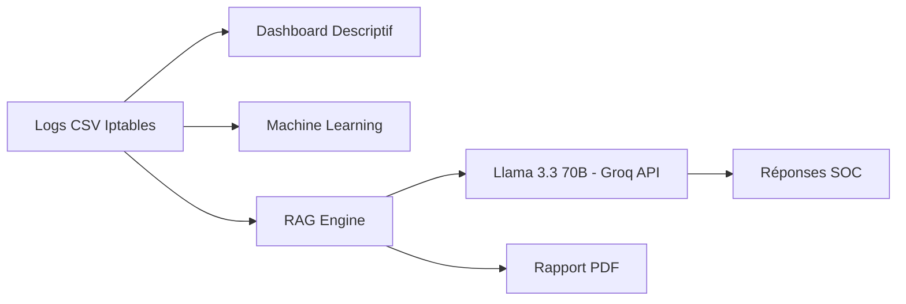
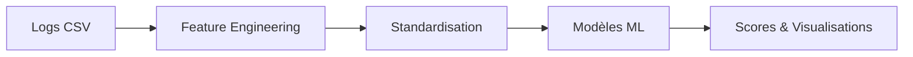
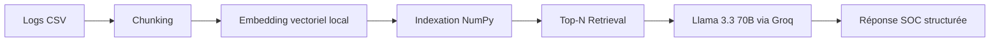

# 🛡️ Challenge SISE x OPSIE — Plateforme Complète d’Analyse Cyber

## 🎯 Présentation du Projet

Ce projet regroupe **trois modules complémentaires** pour l’analyse avancée de logs Iptables :

1. 📊 Dashboard descriptif interactif  
2. 🤖 Module Machine Learning (détection & classification)  
3. 🧠 Module RAG + LLM (SENTINEL SOC Assistant)

L'objectif est de proposer une **chaîne complète d’analyse sécurité** allant de la visualisation simple jusqu’à l’assistance SOC augmentée par LLM.

---

# 🏗️ Architecture Globale

## Vue d’ensemble



---

# 📦 Structure du Projet

```
Challenge-SISExOPSIE/
│
├── views/
│   ├── dashboard.py
│   ├── ml_analysis.py
│   ├── llm_expert.py
│
├── data/
│   └── data_exm.csv
│
├── .env
├── requirements.txt
└── app.py
```

---

# 📊 1️⃣ Dashboard Descriptif

Fonctionnalités :

- Vue globale des flux Permit / Deny
- Filtres par protocole et plage de ports (RFC 6056)
- Analyse TCP vs UDP
- Top IP sources
- Distribution des ports
- Export CSV

---

# 🤖 2️⃣ Module Machine Learning

Modèles implémentés :

- Isolation Forest
- LOF
- K-Means
- Régression Logistique
- Arbre CART
- Random Forest
- ACP

Pipeline :



---

# 🧠 3️⃣ Module RAG + LLM (SENTINEL)

## Architecture RAG



## 🔎 Fonctionnement

1. Les logs sont transformés en chunks textuels.
2. Chaque chunk est vectorisé (embedding local 512 dimensions).
3. Les embeddings sont indexés en mémoire.
4. La requête utilisateur est vectorisée.
5. Les Top-N chunks pertinents sont injectés dans le prompt.
6. Llama 3.3 70B génère une réponse structurée SOC.

---

# 🚀 Installation Complète

## 1️⃣ Cloner le projet

```bash
git clone https://github.com/VOTRE-REPO/Challenge-SISExOPSIE.git
cd Challenge-SISExOPSIE
```

---

## 🐳 Lancement avec Docker

### 2️⃣ Créer le fichier .env

Créer un fichier `.env` à la racine :

```env
GROQ_API_KEY=VOTRE_CLE_GROQ_ICI
```

⚠️ Ne jamais versionner ce fichier.

### 3️⃣ Construire l’image

```bash
docker build -t sentinel-soc .
```

### 4️⃣ Lancer le conteneur

```bash
docker run -p 8501:8501 --env-file .env sentinel-soc
```

Puis ouvrir :

http://localhost:8501

---

## 💻 Lancement Local (sans Docker)

```bash
python -m venv venv
```

Activation :

Windows :
```bash
venv\Scripts\activate
```

Mac/Linux :
```bash
source venv/bin/activate
```

Installer les dépendances :

```bash
pip install -r requirements.txt
```

Lancer :

```bash
streamlit run app.py
```

---

# 🔑 Configuration LLM (Groq)

1️⃣ Aller sur https://console.groq.com/  
2️⃣ Créer un compte  
3️⃣ Générer une clé API  
4️⃣ Ajouter dans `.env` :

```env
GROQ_API_KEY=VOTRE_CLE_ICI
```

Modèle utilisé :

```
llama-3.3-70b-versatile
```

---

# 📄 Génération Rapport PDF

Le module RAG permet :

- Génération automatique d’un rapport structuré
- Export PDF professionnel
- Basé uniquement sur les données réelles

---

# 🔐 Sécurité

- Clé API isolée dans `.env`
- RAG strictement basé sur données locales
- Prompt contraint anti-hallucination

---

# 👨‍🎓 Contexte Académique

Projet réalisé dans le cadre du challenge **SISE x OPSIE 2026**.

### Auteurs

- Maissa Lajimi  
- Aya Mecheri  
- Mazilda Zehraoui  

---

# 🏁 Conclusion

Une plateforme SOC moderne combinant :

Dashboard + Machine Learning + RAG + LLM + Génération PDF

Intégration complète Data Engineering, IA et Cybersécurité.

