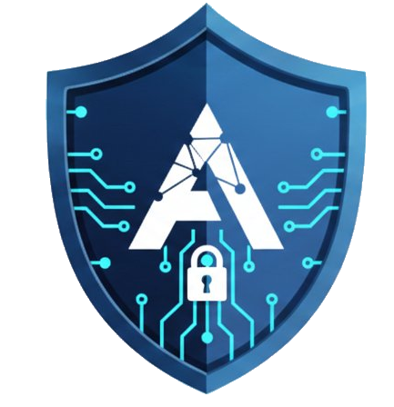
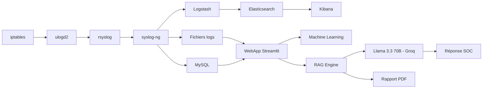
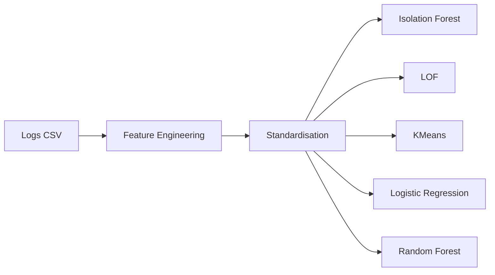
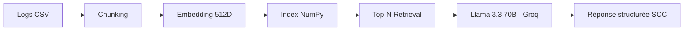

# 🛡️ Challenge SISE × OPSIE 2026  
<p align="center">
  
</p>

<p align="center">
  <i>Plateforme complète d'analyse cyber, supervision et intelligence décisionnelle</i>
</p>

---

# 🌍 Vision du projet

Ce projet est né d’un objectif simple mais ambitieux : construire une chaîne complète allant 
de la génération des logs firewall jusqu’à leur interprétation intelligente.

Nous avons combiné deux dimensions complémentaires :

• La partie OPSIE (infrastructure cyber et journalisation)  
• La partie Data Science (analyse, Machine Learning et LLM)

L’ensemble forme une plateforme cohérente, capable de :
- Collecter les logs en temps réel
- Les normaliser et les stocker
- Les visualiser (Kibana + WebApp)
- Détecter des comportements suspects
- Générer des analyses SOC structurées via un LLM
- Produire automatiquement un rapport PDF

---

# 🏗️ Architecture Globale



Cette architecture illustre la continuité complète entre infrastructure réseau et intelligence artificielle.

---

# 🔐 Partie OPSIE — Infrastructure Cyber

La première étape consiste à mettre en place une chaîne robuste de collecte et centralisation des logs.

Le flux principal est le suivant :

`iptables → ulogd2 → rsyslog → syslog-ng → (fichier + MySQL + Logstash) → Elasticsearch → Kibana`

Les services Docker utilisés sont :
- opsie-fw (firewall)
- opsie-syslog
- opsie-db (MySQL)
- opsie-pma
- opsie-logstash
- opsie-elasticsearch
- opsie-kibana

Les champs normalisés incluent notamment :
datetime, ipsrc, ipdst, proto, dstport, action, policyid, interface_in, interface_out.

Cette partie garantit la traçabilité, la centralisation et la supervision des événements réseau.

---

# 📊 Dashboard & WebApp

La WebApp Streamlit permet une exploration interactive des logs extraits.

Elle propose notamment :
- Comparaison TCP vs UDP
- Analyse Permit / Deny
- Filtrage selon la RFC 6056
- Top 5 IP sources
- Top 10 ports <1024 avec accès autorisé
- Identification des IP hors plan d’adressage
- Exploration tabulaire dynamique (équivalent renderDataTable via st.dataframe)

L’objectif est d’offrir une lecture rapide et exploitable de la posture réseau.

---

# 🤖 Machine Learning

La partie ML transforme les logs en profils comportementaux exploitables.

Pipeline général :



Les modèles permettent :
- Détection d’anomalies (Isolation Forest, LOF)
- Segmentation comportementale (KMeans)
- Classification supervisée (Logistic Regression, CART, Random Forest)
- Interprétation via règles décisionnelles

Les métriques utilisées incluent Accuracy, AUC-ROC et validation croisée stratifiée.

---

# 🧠 RAG + LLM (SENTINEL)

La couche intelligente repose sur une architecture RAG (Retrieval-Augmented Generation).



Le fonctionnement est le suivant :

Les logs sont découpés en blocs analytiques.  
Chaque bloc est vectorisé (embedding local 512 dimensions).  
La requête utilisateur est comparée aux blocs via similarité.  
Les plus pertinents sont injectés dans le prompt du modèle Llama 3.3 70B (via Groq).  

Le système produit une analyse structurée, contextualisée et exploitable.

---

# 🔑 Configuration LLM

Créer un compte sur :  
https://console.groq.com/

Générer une clé API puis créer un fichier `.env` à la racine :

```
GROQ_API_KEY=VOTRE_CLE_ICI
```

Modèle utilisé :

`llama-3.3-70b-versatile`

La clé ne doit jamais être versionnée.

---

# 🚀 Lancement

### Setup initial
Clonez le dépôt et préparez votre environnement :

```bash
git clone https://github.com/VOTRE-REPO/Challenge-SISExOPSIE.git
cd Challenge-SISExOPSIE

# Créer le fichier .env avec votre clé API
echo "GROQ_API_KEY=votre_clé_ici" > .env
```

---

### Choisissez votre méthode

### 🐳 Option 1 : Docker

**Build de l’image :**

```bash
docker build -t challenge-sise .
```

**Lancer le conteneur :**

```bash
docker run -p 8501:8501 --env-file .env challenge-sise
```

### 💻 Option 2 : Installation Locale

**1️⃣ Créer et activer un environnement virtuel :**

```bash
python -m venv env

# Windows :
env\Scripts\activate

# Mac / Linux :
source env/bin/activate
```

**2️⃣ Installer les dépendances :**

```bash
pip install -r requirements.txt
```

**3️⃣ Lancer l’application :**

```bash
streamlit run app.py
```

---

### 🌐 Accès à l’application
Une fois le service démarré, l’interface est accessible ici :  

```
http://localhost:8501
```


> **Note :** Pour naviguer entre les pages dans la barre latérale, il ne suffit pas de cliquer sur le titre de la page. Il faut cliquer **juste en dessous du titre** pour que la sélection fonctionne.

# 🎓 Contexte Académique

Projet réalisé dans le cadre du Master 2 SISE et Master 2 OPSIE — Université Lumière Lyon 2  
Année universitaire 2025–2026

---

# 👥 Équipe Projet

__Maissa Lajimi__, 
__Aya Mecheri__,
__Mazilda Zehraoui__,
__Aatany Oussama__, 
__Benayache Houssam__ et 
__Mezzourh Yassine__  

---

# 🏁 Conclusion

Ce projet démontre l’intégration complète entre infrastructure cyber, analyse de données, 
Machine Learning et intelligence artificielle générative.

Il ne s’agit pas seulement d’un dashboard ou d’un firewall, 
mais d’une plateforme unifiée de supervision intelligente.
