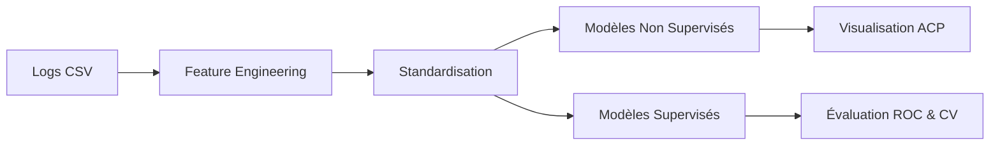

# 🤖 Module Machine Learning — Analyse Avancée des Logs Iptables

## 🎯 Objectif

Ce module implémente une chaîne complète d’apprentissage automatique pour :

- Détecter des comportements anormaux
- Classifier les flux réseau
- Extraire des règles interprétables
- Visualiser les structures cachées

---

# 🏗️ Pipeline Global

---

# 🔬 1. Feature Engineering

Chaque IP source est transformée en vecteur comportemental :

- Nombre_Ports_Distincts
- Nombre_Rejets
- Nombre_Connexions
- Duree_Minutes
- Vitesse_Connexion_Par_Minute
- Ratio_Rejet
- Ratio_TCP
- Port_Max

But : transformer des logs événementiels en profils exploitables.

---

# 🌲 2. Isolation Forest

### Paramètres :
- contamination : 0.01 → 0.20
- n_estimators : 50 → 500
- random_state : 42

### Principe :
Les anomalies sont isolées plus rapidement dans des arbres aléatoires.

Score :
- Plus négatif = plus suspect

---

# 📡 3. Local Outlier Factor (LOF)

### Paramètres :
- n_neighbors : 5 → 50
- contamination

### Principe :
Compare la densité locale d’un point à celle de ses voisins.

---

# 🔵 4. K-Means

### Paramètres :
- Nombre de clusters K (2 → 12)
- n_init = 10
- random_state = 42

Méthodes d’évaluation :
- Inertie (méthode du coude)
- Coefficient de silhouette

---

# 🎯 5. Classification Supervisée

### Variables utilisées :
- Port_Destination
- Est_TCP
- Tranche_Port
- Heure
- Jour_Semaine

### Modèles :

- LogisticRegression (L1 & L2)
- DecisionTreeClassifier (max_depth=4)
- RandomForestClassifier (100 arbres, max_depth=5)

### Évaluation :
- Validation croisée StratifiedKFold (5 plis)
- Accuracy
- AUC-ROC
- Courbes ROC

---

# 🌳 6. Extraction de Règles (CART)

Paramètres ajustables :
- max_depth (2 → 6)
- min_samples_leaf (5 → 100)

Sorties :
- Règles textuelles
- Importance Gini
- Matrice de confusion

---

# 📊 ACP (Analyse en Composantes Principales)

Objectif :
- Réduction dimensionnelle
- Validation visuelle des anomalies

Sorties :
- Plan factoriel
- Variance expliquée
- Cercle des corrélations

---

# 📌 Conclusion

Module complet combinant :
- Détection non supervisée
- Classification supervisée
- Interprétabilité
- Validation visuelle
