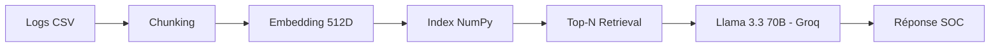

# 🧠 Module RAG + LLM — SENTINEL SOC

## 🎯 Objectif

Assistant SOC basé sur RAG permettant :

- Analyse en langage naturel
- Réponses structurées
- Génération rapport PDF

---

# 🏗️ Architecture RAG

---

# 🔎 Chunking

Blocs générés :
- Résumé global
- Top IP
- Ports ciblés
- Analyse temporelle
- Règles firewall
- IP suspectes
- Échantillons logs

---

# 📐 Embedding

Méthode :
- Hash MD5 par mot
- Projection sur vecteur 512D
- Normalisation L2

Avantage :
- Rapide
- Sans dépendance externe

---

# 🎯 Retrieval

- Produit scalaire pour similarité
- Sélection Top-N (2 → 8)
- Injection dans prompt

---

# 🤖 Modèle

Modèle :
llama-3.3-70b-versatile

Paramètres :
- temperature = 0.2
- max_tokens = 1500

Prompt strict :
- 200-350 mots
- Structure en sections
- Indicateurs de sévérité

---

# 📄 Rapport PDF

- Multi-retrieval thématique
- Fusion contexte
- Génération via REPORT_PROMPT
- Export FPDF stylisé

---

# 🔐 Sécurité

- Réponses basées uniquement sur contexte RAG
- Clé API dans .env :
GROQ_API_KEY=VOTRE_CLE
